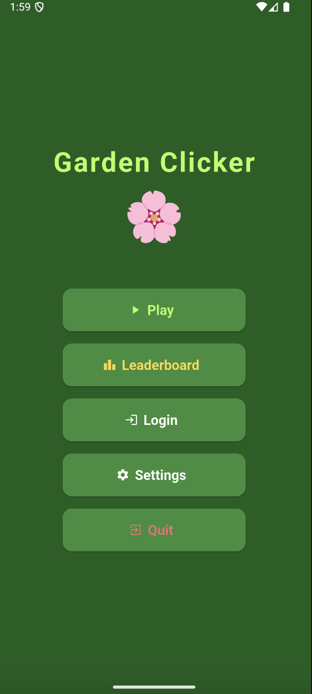
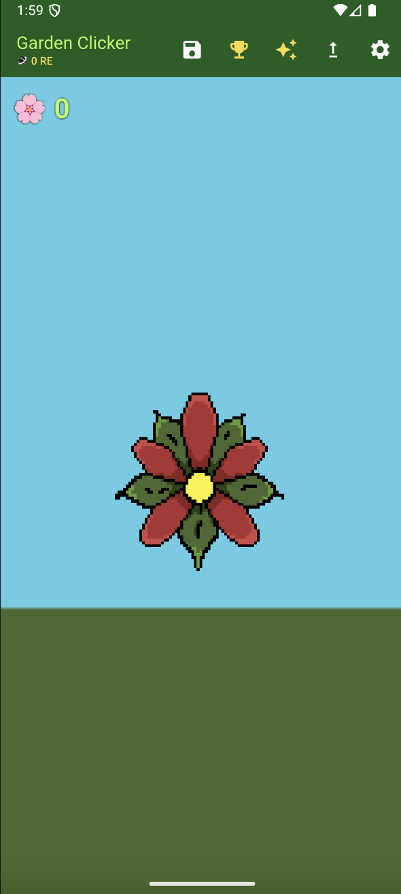
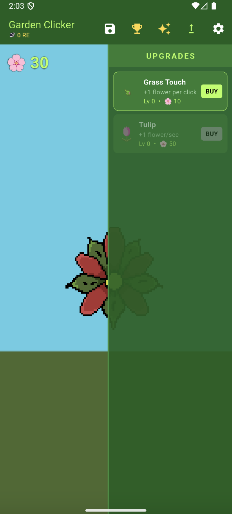
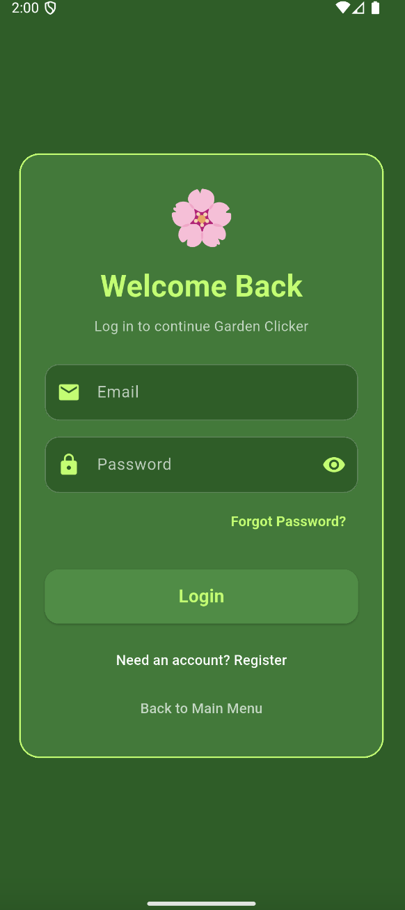
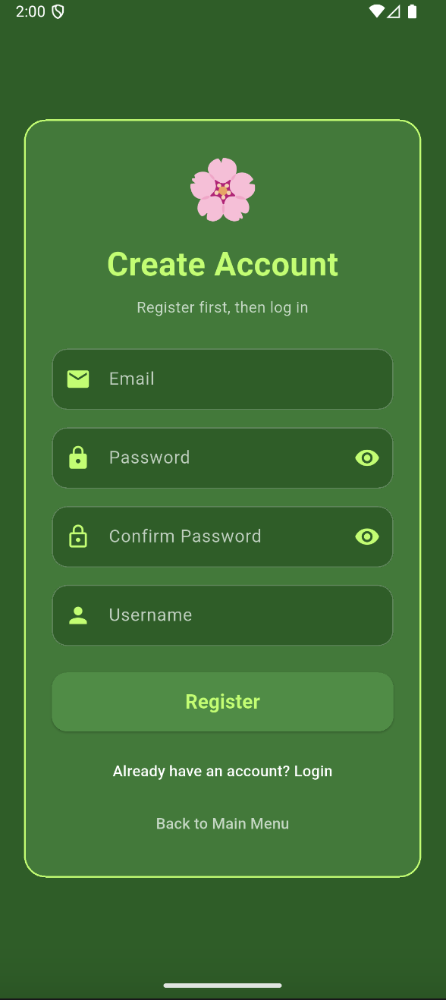
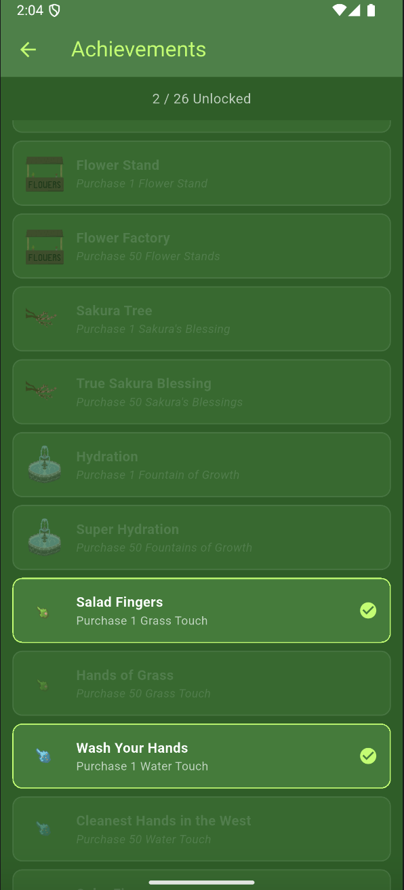
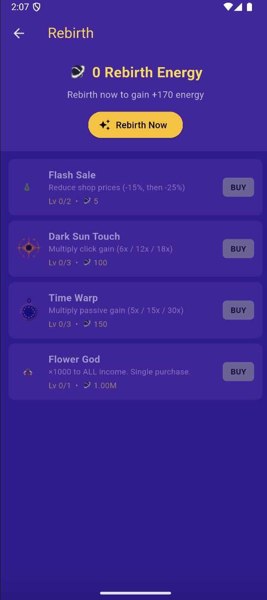
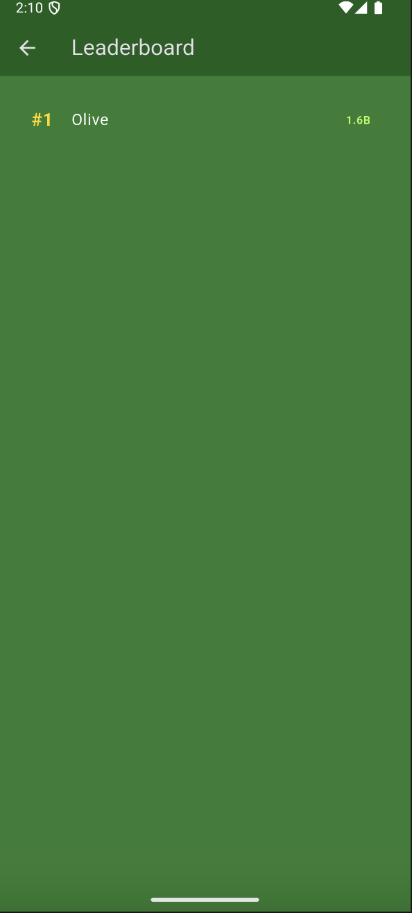
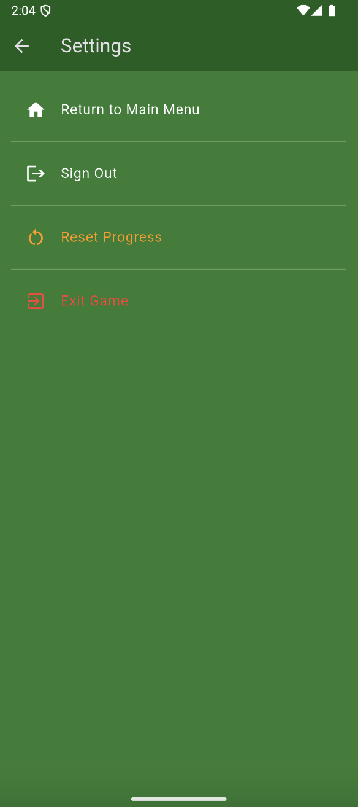

# Garden Clicker 🌱

A relaxing 2D pixel-art incremental game built with **Flutter, Flame, and Firebase**. Players grow a virtual garden, collect flowers, purchase upgrades, complete achievements, save their progress, and compete on an online leaderboard.

## Screenshots

<table>
  <tr>
    <td align="center"><br><b>Main Menu</b></td>
    <td align="center"><br><b>Gameplay</b></td>
    <td align="center"><br><b>Upgrade Shop</b></td>
  </tr>
  <tr>
    <td align="center"><br><b>Login</b></td>
    <td align="center"><br><b>Registration</b></td>
    <td align="center"><br><b>Email Verification</b></td>
  </tr>
  <tr>
    <td align="center"><br><b>Achievements</b></td>
    <td align="center"><br><b>Rebirth Shop</b></td>
    <td align="center"><br><b>Leaderboard</b></td>
  </tr>
</table>

## Quick Start

HOW I START: DOWNLOAD ZIP, RUN ANDROID STUDIO,
IN COMMAND PROMPT: git config --global -add safe.directory '*'
IN GIT BASH: git config --global --add safe.directory '*"
,OPEN IN ANDROID STUDIO FLUTTER THE DOWNLOADED FILE, RUN ON EMULATOR AS MOBILE GAME

Install [Flutter](https://docs.flutter.dev/get-started/install), download and extract the repository, then:

- **Windows:** double-click `run.bat`
- **macOS/Linux:** run `chmod +x run.sh && ./run.sh`

The launcher enters the `blueprint` app folder, installs the Flutter packages, and lets you choose an available device.

### Manual Run

```bash
cd blueprint
flutter pub get
flutter run
```

If Git reports a safe-directory warning, run(HOW I RUN WHEN OPENING ANDROID STUDIO):

```bash
git config --global --add safe.directory '*'
```
```command prompt
git config --global --add safe.directory '*'
```

## Features

- Flower collection through tap-based gameplay
- Upgradeable click power
- Passive flower income from purchasable upgrades
- Increasing upgrade prices and rebirth discounts
- Rebirth system with permanent bonuses
- Achievement tracking with in-game notifications
- Firebase registration and email/password login
- Email-based two-factor verification
- Password recovery and guest play
- Automatic cloud saving every 30 seconds
- Manual saving and save deletion
- Online leaderboard
- Settings and profile management

## How It Works

Tapping the main flower increases the player's flower total using the current click-power value. Shop upgrades improve click power or generate passive flowers every second. Once players reach 1,000,000 flowers, they can rebirth and exchange progress for rebirth energy, which buys permanent upgrades such as stronger clicks, shop discounts, faster passive income, and large overall multipliers.

Signed-in users have their flowers, upgrades, rebirth progress, and achievements stored in Cloud Firestore. The game loads this data after login and saves it automatically during play. Guests can play without creating an account, but their progress is not stored in the cloud.

## Technologies

- Flutter and Dart
- Flame game engine
- Firebase Authentication
- Cloud Firestore
- EmailJS
- Shared Preferences
- Android and Chrome targets

## Project Structure

- `blueprint/lib` – Dart application and game logic
- `blueprint/assets` – pixel-art images and animations
- `blueprint/android`, `ios`, `web`, `windows`, `macos`, `linux` – platform targets
- `docs/screenshots` – application screenshots
- `App.Dev.FinalProject.Slides.pdf` – project presentation
- `AppDevFinalDoc.pdf` – supporting documentation

## Design and Architecture

Upgrades, rebirth upgrades, and achievements are defined separately from their managers, making the project easier to extend. Dedicated managers handle upgrades, rebirths, achievements, and serialization. `ValueNotifier` updates only the widgets affected by changing game values, while Flame's update loop calculates passive income without blocking the interface.

Firestore saves are merged into one user document. Authentication changes reset and reload the game state to avoid data carrying between different users.

## Kiara Bartuccio's Contributions

- Designed and implemented responsive Flutter interfaces
- Created the game's colors, theme, fonts, icons, buttons, and spacing
- Worked on the splash screen, settings, play button, and quit button
- Improved screen navigation, usability, accessibility, and user feedback
- Set up the initial Firebase integration
- Implemented login, registration, password recovery, validation, and error handling
- Connected the authentication interface to Firebase Authentication
- Implemented email-based two-factor verification with EmailJS
- Contributed to feature planning, application flow, presentations, and documentation

## Settings

<p align="center">
  
</p>

## Contributors

- Kiara Bartuccio
- Oliver D'Avino
